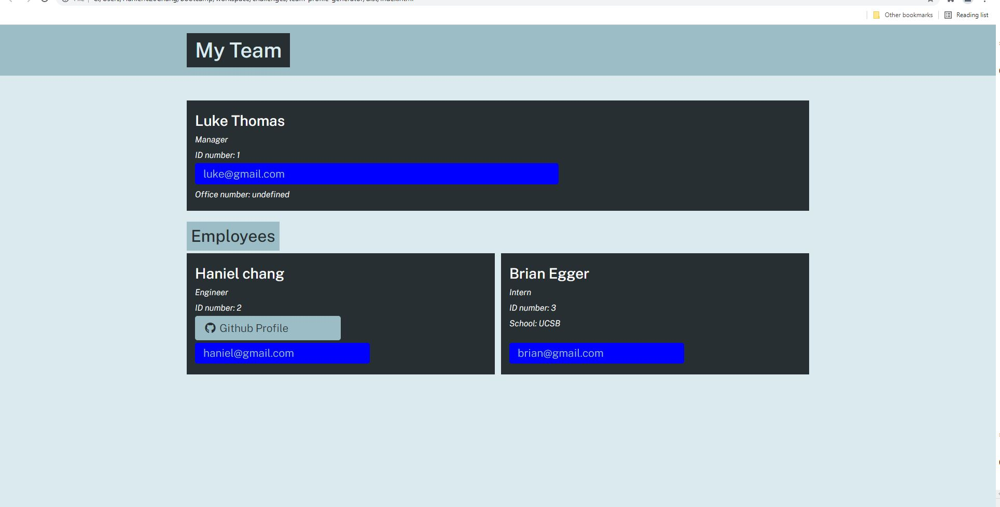

# team-profile-generator

## Description
This is an application that allows for creating a team profile. When starting the app, it first prompts for the manager's information.
After submitting that information, you are given the option to add an intern or engineer. When you choose either of these options, you 
are also required to submit information for their profiles to be displayed on the HTML. The program continues to prompt until the user
answers "no" when prompted to add another member. Afterwards, an HTML file is generated showing the team profile. Below is a screenshot.

### Application Screenshot

